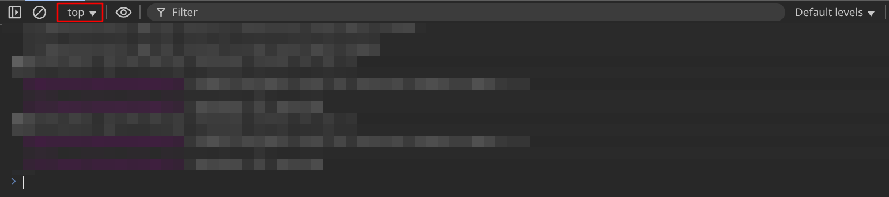

<!--
SPDX-FileCopyrightHeader: Copyright © 2025 Lenny McLennington <lenny@sneed.church>. All rights reserved.
SPDX-FileContributor: Lenny McLennington <lenny@sneed.church>
SPDX-License-Identifier: AGPL-3.0-only
-->

# Farm Merge Valley Cheat

## License

This software is licensed under GNU Affero General Public License, version 3

## Method to initialise the cheat

<details>
Steps 2-4 ("Set up the injection point") only need to be done once every time the game updates. If you have already set up the breakpoint, you can just initialise the cheat by doing step 1 then skipping to steps 5 and onward.

### Open the game

1. Press F12 or Ctrl+Shift+I to open the Developer Tools, then open Farm Merge Valley. The game will be black because its code is paused as soon as it begins to load. This is normal and expected, it will be black until you've finished loading the cheat. **TIP:** If you press **Esc** while the developer tools are focused, it will toggle the console panel, which is useful for quick access to write code in the console without needing to click back and forth to the console tab.

### Set up the injection point

2. Make sure the developer tools are focused, and press **Ctrl+Shift+P** and type in `Disable JavaScript source maps` and press enter to disable source maps, this is required because source maps interfere with the method of injecting the cheat. If it doesn't show up, that means source maps are already disabled so don't worry.
3. Press **Ctrl+P** and paste `game.g.eb040983274006b15665.js:1:3747` then press enter, it should take you to a specific line in the code and highlight it orange so it's easy for you to find the position of the text cursor.
4. Set a breakpoint on that line by clicking the left part of the sidebar in on the same line as the current text cursor position.

### Load the cheat

5. The game will be paused on a debugger trap. In order to bypass it, copy the code below and paste it into the console, then press enter:
<details>

```js
Function.prototype.constructor = new Proxy(Function.prototype.constructor, {
  apply(target, thisArg, argumentsList) {
    if (argumentsList.length === 1 && argumentsList[0] === "debugger") {
      return () => {};
    }

    return Reflect.apply(target, thisArg, argumentsList);
  },
});
```

</details>

6. Resume script execution by pressing F8, or by pressing **Ctrl+Shift+P** and typing "Resume script execution" then pressing enter.
7. After you've resumed script execution, the debugger should break again. This time it will be on the breakpoint that you previously set in step **3**. Now, copy the code below and paste it into the console, then press enter:

<details>

```js
// SPDX-FileCopyrightHeader: Copyright © 2025 Lenny McLennington <lenny@sneed.church>. All rights reserved.
// SPDX-FileContributor: Lenny McLennington <lenny@sneed.church>
// SPDX-License-Identifier: AGPL-3.0-only

const firstValue = (obj) => {
  return Object.values(obj)[0];
};

class Cheat {
  initialised = false;

  // modules
  game = null;
  behaviors = null;
  gameplayMapScreen = null;

  mergeSystem = null;
  rewardSystem = null;
  upgradeCardSystem = null;
  rankBar = null;

  // module importing stuff
  fmvImport = null;
  gameSingletonId = null;
  behaviorsId = null;

  constructor(fmvImport, gameSingletonId, behaviorsId) {
    this.fmvImport = fmvImport;
    this.gameSingletonId = gameSingletonId || gameSingletonId;
    this.behaviorsId = behaviorsId || behaviorsId;
  }

  get backendServices() {
    return this.game.services;
  }

  get worldServices() {
    return this.gameplayMapScreen.services;
  }

  init() {
    if (this.initialised) return;

    this.game = firstValue(this.fmvImport(this.gameSingletonId));
    if (!this.game) {
      throw new Error(
        "Game singleton not found. Please ensure you are using an up-to-date version of the script, and following the instructions.",
      );
    }
    this.behaviors = firstValue(this.fmvImport(this.behaviorsId));
    if (!this.behaviors) {
      throw new Error(
        "Behaviors module not found. Please ensure you are using an up-to-date version of the script, and following the instructions.",
      );
    }

    this.gameplayMapScreen = this.game.services.canvas.stage.getChildByName(
      "GameplayMapScreen",
      true,
    );

    this.rewardSystem = this.gameplayMapScreen._systems.find(
      (x) => x._processReward,
    );
    this.mergeSystem = this.gameplayMapScreen._systems.find(
      (x) => x._luckyMergeChance,
    );
    this.upgradeCardSystem = this.gameplayMapScreen._systems.find(
      (x) => x._updateUpgradeCardObject,
    );
    this.rankBar = Object.values(
      this.game.services.navigation.hudLayer.hudContainer.getAllUIElements(),
    ).find((x) => x.AnimateRankBar);

    this.initialised = true;
  }

  spawnCollectable(target, amount) {
    const object = this.spawnAtClosestEmptyToCenter(`gem_1`);

    object.getBehavior("collectable")._data.reward = [
      { key: target, amount: amount },
    ];
    this.worldServices.world.addGameObject(object);

    return object;
  }

  spawnAtClosestEmptyToCenter(id) {
    const object = this.backendServices.gameObjectFactory.createById(id);

    object.addBehavior(
      new this.behaviors.gridPosition(
        this.worldServices.visibleCells.getClosestEmptyToTheCenter(),
      ),
    );

    return object;
  }

  spawnBubbledObject(target) {
    return this.worldServices.rewardService.giveObjectReward({
      rewards: [target],
      container: this.gameplayMapScreen,
      animationEndEvent: null,
      bubblePosition: { x: 0, y: -200 },
    });
  }

  spawnObject(target) {
    let object = this.spawnAtClosestEmptyToCenter(target);
    this.worldServices.world.addGameObject(object);
    return object;
  }

  spawnUpgradeCard(target, tier) {
    if (!(1 <= tier && tier <= 3)) return;

    const object = this.spawnAtClosestEmptyToCenter(`upgrade_card_${tier}`);
    const behavior = object.getBehavior("upgradeCard");
    this.upgradeCardSystem._updateUpgradeCardObject(object, behavior, target);

    this.worldServices.world.addGameObject(object);

    return object;
  }

  // 100 = always lucky merge, 0 = never lucky merge, default is 5
  setLuckyMergeChance(percentage) {
    this.mergeSystem._luckyMergeChance = percentage;
  }

  setLevel(level) {
    this.backendServices.experience._levelInventory.amount = level;
    this.rankBar.AnimateRankBar();
  }

  addLevels(amount) {
    this.backendServices.experience._levelInventory.amount += amount;
    this.rankBar.AnimateRankBar();
  }

  addExp(amount) {
    this.backendServices.experience.addExp(amount);
    this.rankBar.AnimateRankBar();
  }

  deleteObstacles() {
    this.worldServices.world
      .getAllGameObjects()
      .filter(
        (x) =>
          x.hasBehavior("hitpoints") &&
          !x.hasBehavior("shovelable") &&
          !x.hasBehavior("movable"),
      )
      .forEach((x) => this.worldServices.world.removeGameObject(x));
  }

  findBlueprintsWithBehaviour(behaviour) {
    return Array.from(this.backendServices.blueprintCollection._blueprints)
      .map((x) => x[1])
      .filter((x) => Object.keys(x.components).includes(behaviour));
  }

  altFindBlueprintsWithBehaviour(behaviour) {
    return Array.from(this.backendServices.blueprintCollection._blueprints)
      .map((x) => x[1])
      .filter(
        (x) =>
          Object.keys(x.components).includes(behaviour) &&
          !x.id.startsWith("base_"),
      )
      .map((x) => x.id);
  }

  giveInventoryItem(target, amount) {
    // The generic method works for level but it's better to use addLevels because it includes proper animation.
    if (target === "level") {
      return this.addLevels(amount);
    }

    // fallback to non-animated version since the animation (giveInventoryReward) doesn't work for negative or zero
    if (amount < 1) {
      return this._setInventoryAmountDelta(target, amount);
    }

    return this.worldServices.rewardService.giveInventoryReward({
      reward: { key: target, amount: amount },
      parent: this.gameplayMapScreen,
    });
  }

  setInventoryAmount(target, amount) {
    this.backendServices.inventory.setAmount(target, amount);
  }

  _setInventoryAmountDelta(target, delta) {
    this.backendServices.inventory.addAmount(target, delta);
  }

  getValidItemTypes() {
    return this.backendServices.inventory._model._inventoryItems
      .keys()
      .toArray();
  }
}

let CheatAutoInit = new Proxy(Cheat, {
  construct(target, args) {
    const instance = new target(...args);
    const proxiedInstance = new Proxy(instance, {
      get: (target, prop) => {
        const orig = target[prop];
        if (
          typeof orig === "function" &&
          prop !== "init" &&
          prop !== "fmvImport"
        ) {
          return (...arguments) => {
            target.init();
            return orig.apply(target, arguments);
          };
        }
        return orig;
      },
    });

    proxiedInstance._inner = instance;

    return proxiedInstance;
  },
});

const fmvImport =
  (() => {
    let fmvImport = undefined;
    try {
      fmvImport = _0x32bc2d;
    } catch (e) {}
    return fmvImport;
  })() || window.cheat?.fmvImport;

if (!fmvImport) {
  console.warn(
    "No fmvImport function found. Please ensure you are following the instructions correctly.",
  );
} else {
  window.cheat = new CheatAutoInit(fmvImport, 0x11688, 0x130f5);
}

```

</details>

8. Now you can just repeat step **6** to fully resume the execution of the game.

</details>

## Troubleshooting

<details>

### Uncaught ReferenceError: cheat is not defined

This would happen if you close the developer tools and re-open them, meaning the execution context gets reset to "top". In order to go back to the Farm Merge Valley execution context, click the dropdown which would now say "top", and find where it says "https://1187013846746005515.discordsays.com/", and select that.



</details>

## Functionality

<!-- TODO: parse assets-manifest.json to get the list of items that can be spawned. -->

The current functionality of the cheat is as follows, you can type these into the console in the developer tools after the game has loaded:

### Set your level

E.g. if you want to set your level to 10

```js
cheat.setLevel(10);
```

Or if you want to add 10 levels to your current level:

```js
cheat.addLevels(10);
```

Or add 100000 EXP

```js
cheat.addExp(100000);
```

### Spawn an object

gem_1 is the smallest type of gem, gem_2 is the result of merging gem_1, etc.

This applies to other objects like cow_1, cow_2; chicken_1, chicken_2; etc.

A full list of spawnable items will be provided in a future update.

```js
cheat.spawnObject("gem_1");
```

You can spawn an object in a bubble by doing:

```js
cheat.spawnBubbledObject("gem_1");
```

### Spawn an upgrade card

You can spawn an upgrade card for a specific upgrade type, e.g. "wheat", "cow", etc.

A full list of upgrade types will be provided in a future update.

For example, to spawn a level 2 wheat upgrade card, you would do:

```js
cheat.spawnUpgradeCard("wheat", 2);
```

### Delete obstacles

You can delete all obstacles from the entire map by doing:

```js
cheat.deleteObstacles();
```

### Give inventory items

You can give yourself a specific amount of items to your inventory. For example, if you want to give yourself 100 additional wheat, you would do:

```js
cheat.giveInventoryItem("wheat", 100);
```

You can also use setInventoryAmount to set the amount of an item in your inventory to a specific value rather than adding to the existing amount:

```js
cheat.setInventoryAmount("wheat", 100);
```

A full list of inventory items is available by running

```js
cheat.getValidItemTypes();
```

### Set lucky merge chance

You can set the lucky merge chance to a specific value, e.g. 50 for 50% chance (the default chance is 5):

```js
cheat.setLuckyMergeChance(50);
```

If you set it to 100 then 100% of merges will be lucky merges.

### TODO

These still need to be documented

- spawnCollectable
